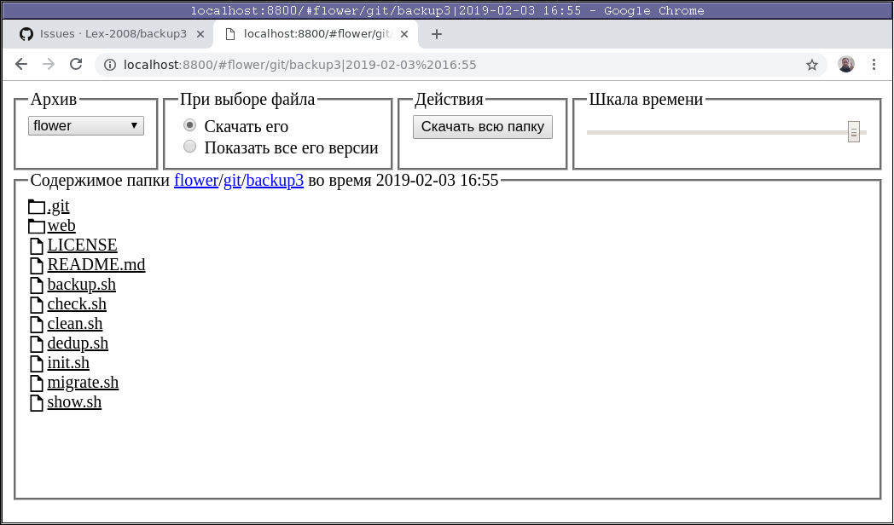
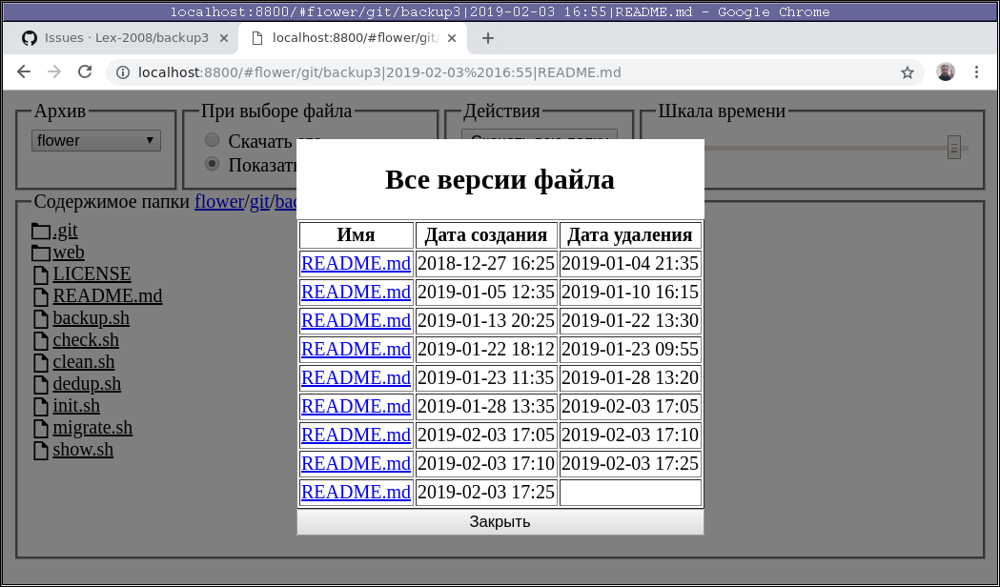

backup3
=======

My third _and a half_ attempt at making backups - using ~~bash~~ _busybox_, ~find~ _comm -3_, and SQLite.

Background
----------

### History

My [previous backup system][1] was based on hardlinks - as often as every 5 minutes most of backup tree was `cp -al`'ed from _previous_ to newly-created _current_ dir, and then `rsync` was running to apply any changes.
As a result - I had snapshots as frequent as every 5 minutes, each of them contained only changes since last rsync run (few megabytes).
Advanced heuristic was running to delete old snapshots while keeping some of them (hourly, daily, monthly) longer.
Sounds good, right?

[1]: http://alexey.shpakovsky.ru/en/rsync-backups.html

And it was good indeed, while I assumed that directories are created and deleted instantly.
But after a while I noticed that cleaning up disk space takes awfully long time: deleting each snapshot took 10~15 minutes, and freed only a few megabytes.
How long should it be running to clean 10 Gb?

### Idea

So the idea is to keep only _one_ copy of each unique file, plus keep _somewhere_ a time range when it existed, and use a script to reconstruct file tree for a given time using this data. Sounds like a good task for a database?

So it work like this:

* First, rsync updates all files in a "current backup" directory.
  By default it doesn't do it "in place" - instead, it first creates new version and then replaces old one with it, so _its inode number changes_.
  Note this! We will use it later.

* Then, we compare current state of "current backup" dir with what was there previously:

  * New files we hardlink to "storage" directory (so they didn't get lost when deleted from "current backup" some day later),
    and record them into database, together with "creation" date.

  * For deleted files we just note their "deletion" date in the database.

  * Changed files we treat as "old version deleted, new version created".

#### How do we compare?

To notice changes in new and deleted files, we can just save list of all files, like this: `find -type f >files.list.new` ~and run `diff` to compare it to previous version~.
Then new files will appear in diff marked with `>` symbol, and deleted - with `<`.~

Update: `diff` sometimes gets confused when many lines get changed, and reports not-changed files as both created and deleted.
I've moved to `comm -3` utility since then - when comparing two files, it prefixes lines unique to second file with tab character, and (due to `-3` argument) skips lines which present in both files.
Lines unique to first file are printed not-tab-indented.

To track also changed files, we actually need to record inode number together with filename - in case it's modified by rsync (remember that rsync changes inode number when modifying files), line if `find` output will change, and `comm -3` output will have two lines - one for "deletion" of old line, and one for "addition" of new one - exactly what we want!

Setup
-----

Find a writeable dir to keep your backups in (say, `/var/backups`) and run:

	BACKUP_ROOT=/var/backups init.sh

It will create necessary dirs and sqlite database to hold information.

### Requirements

* sqlite3
* busybox (ash, du, df, also httpd for [WebUI](#webui))
* find
* flock
* smbclient (if using password-protected dirs in WebUI)
* par2create (if creating par2 files)
* cpulimit (if limiting cpu usage by par2 process)

Simple usage
------------

To backup your `/home` directory every now and then, save this file into your
crontab:

	# Required config
	export BACKUP_ROOT=/var/backups # dir to hold all backups-related data

	# rsync operations, maybe several
	rsync -a --delete /home "$BACKUP_ROOT/current"

	# Run main backup operation
	backup.sh

Advanced usage
--------------

But what if you want to backup, say, your browser data every 5 minutes, and rest
of your `$HOME` directory - only once an hour? Then use a file like this:

	#!/bin/busybox ash

	export BACKUP_ROOT=/var/backups

	run_this()
	{
		# Backup Chrome profile to "browser" subdir on *every* backup
		run_rsync always browser /home/lex/.config/google-chrome/Default/

		# Backup whole home directory once every hour
		run_rsync hourly home /home/lex
	}

	# Run backup operations
	. backup.sh

Note that in last line we _source_ instead of running this script - this way we
can ensure that `backup.sh` script will see declared functions. Also note
hashbang in first line - for performance reasons, `backup.sh` must be executed
by busybox.

### Clean-up

To ensure that 10% of disk space remains free, add these lines to the end of
above file:

	# delete old versions until at least 10% of disk space is free
	clean.sh 10 %

### Protecting against bit rot

To protect against [bit rot][], run this command every month after the monthly
backup:

	par2create.sh 1

It will walk through all files in the last monthly backup and create `*.par2`
archives for files over 300kb. This feature requires [par2cmdline][] installed
(usually available in your distro repos).
Files smaller than 300kb will be just copied to `*.bak` files, because `*.par2`
files will be bigger than files they are protecting.
Running `par2create.sh` without arguments will ensure that `*.par2` or `*.bak`
files exist for all monthly backups, not only for the last one.
To check if par2 archives are valid and no bit rot happened, run this command:

	par2verify.sh

It has same arguments as `par2create.sh`. To check previous month's `*.par2`
files, use these arguments:

	par2verify.sh 2 1

If run in September, this command will check `*.par2` files created by
`par2create.sh 1` command ran in August.

If you have [cpulimit][] installed (usually available in your distro repos),
you can limit the CPU usage by `par2` process. For example, to make it use
about 10% of CPU, export this variable before running the
`par2create.sh`/`par2verify.sh` command:

	export BACKUP_PAR2_CPULIMIT=10

It is especially useful if you use some [fanless][] computer and don't want it
to overheat under the task.

[bit rot]: https://en.wikipedia.org/wiki/Data_degradation
[par2cmdline]: https://github.com/parchive/par2cmdline
[cpulimit]: https://github.com/opsengine/cpulimit
[fanless]: http://alexey.shpakovsky.ru/en/fanlesstech.html

### Restore from backup

You can either dig manually in data dir, or use `show.sh` to show contents of
archive for a given date, or read next big chapter:

Web UI
------

Go to the `web` dir of this repo and run the following command:

	busybox httpd -p 8800

Then navigate to <http://localhost:8800/> in your browser and you can browse
through contents of your backups:

First, select "root" backup dir in top-left corner, then navigate through
directories to the place of interest, use time slider in top-right corner
to select desired time of backup, and after that you have three options:

* Either click one of files to download its version for a given time

* Or click button in top row to download whole directory

* Or change value of switch in top row to show all versions of file instead of
downloading it and click any of file names - you will see a screen where you
can choose which version of the file you want to restore:

### Password protection

Password protection currently implemented via attempt to connect to samba share.
To protect, for example, "root" directory called "private", create text file
`private.pw` next to it with name of user and share, like this:

	lex|\\localhost\private\

This way, when accessing anything in "private" dir, we will try to access
`\\localhost\private\` share using `lex` username and user-provided password.
Note that you need to have `smbclient` installed for this to work.
To override default username, user can provide username in password field,
space-separated before password, like this: `username password`.

Fun stuff
---------

### Getting total number of rows in database

	sqlite3 $BACKUP_DB 'SELECT count(*) FROM history;'

### Checking disk space used by each dir

	cd $BACKUP_ROOT
	echo "Disk usage of each dir:"
	(
		echo 'name current data'
		(
			(
				echo .
				ls data
			) | xargs -I% echo 'echo "% $(test -e current/% && du -BG -d0 current/% | cut -f1) $(du -BG -d0 data/% | cut -f1)"' | sh
		)
	) | column -t

### Getting number of files

	# In current backup
	sqlite3 $BACKUP_DB 'SELECT CASE instr(dirname, "/") WHEN 0 THEN dirname ELSE substr(dirname, 1, instr(dirname, "/")-1) END AS root, count(*) FROM history WHERE freq=0 GROUP BY root LIMIT 10;' | column -tns'|'

	# Deleted
	sqlite3 $BACKUP_DB 'SELECT CASE instr(dirname, "/") WHEN 0 THEN dirname ELSE substr(dirname, 1, instr(dirname, "/")-1) END AS root, count(*) FROM history WHERE freq!=0 GROUP BY root LIMIT 10;' | column -tns'|'

	# Total
	sqlite3 $BACKUP_DB 'SELECT CASE instr(dirname, "/") WHEN 0 THEN dirname ELSE substr(dirname, 1, instr(dirname, "/")-1) END AS root, count(*) FROM history GROUP BY root LIMIT 10;' | column -tns'|'

Note that `-n` argument for `column` command is a non-standard Debian extension

### Checking how much space `*.par2` files are occupying

If you're wondering how much does the protection against bit rot costs you in
sense of gigabytes, just run this command: (taken from [this][a322828]
stackexchange answer):

	find "$BACKUP_ROOT" -type f \( -name '*.bak' -o -name '*.par2' -o -name '*.vol*' \) -printf '%s\n' | gawk -M '{sum+=$1} END {print sum}' | numfmt --to=si

[a322828]: https://unix.stackexchange.com/questions/41550/find-the-total-size-of-certain-files-within-a-directory-branch/322828#322828

### Getting most frequently changed files

	sqlite3 $BACKUP_DB "SELECT dirname, filename, count(*) AS num FROM history GROUP BY dirname, filename ORDER BY num DESC LIMIT 10;"

### Getting latest file in each of "freq" group

	sqlite3 $BACKUP_DB "SELECT freq, MIN(deleted) FROM history WHERE freq != 0 GROUP BY freq;"

Messing with db
---------------

### Check that database is correct

It may happen that data in database is out of sync with actual files. To check
for that, run `check.sh`. To fix it, run `check.sh --fix`. It will correct
information in the database.

### Rebuild database from files

All information in the database is also stored in filenames in backup. To
rebuild database from files, simply run `rebuild.sh`.

### Delete files from backup

If you realised that you've backed up some files that you didn't actually want
to backup (like caches), you can delete them - both from filesystem, like this:

	rm -rf $BACKUP_ROOT/{current,data}/home/.cache

and from database, like this:

	sqlite3 $BACKUP_DB "DELETE FROM history WHERE dirname LIKE 'home/.cache%'"

Or run only the first command, followed by `check.sh --fix`. Remember to exclude
them from the rsync operation - otherwise they will appear in backup again!

### Clean empty dirs

Especially after above command, you're left with a tree of empty directories in
`$BACKUP_DATA`. To get rid of them, run this command (taken from [this][a107556]
stackexchange answer):

	find $BACKUP_MAIN -type d -empty -delete

[a107556]: https://unix.stackexchange.com/questions/8430/how-to-remove-all-empty-directories-in-a-subtree/107556#107556

### Removing duplicates

If you have rdfind installed, you might want to use these commands to hardlink
similar files to each other:

	cd "$BACKUP_ROOT"
	rdfind -ignoreempty false -removeidentinode false -makehardlinks true current data
	sed="s/'/''/g        # duplicate single quotes
		1i BEGIN TRANSACTION;
		\$a END TRANSACTION;
		s_^([0-9]*) ((.*)/)?(.*)_	\\
		UPDATE history SET inode='\\1' WHERE dirname='\\3' AND filename='\\4';	\\
		_"
	/usr/bin/find "$BACKUP_CURRENT" $BACKUP_FIND_FILTER \( -type f -o -type l \) -printf '%i %P\n' | sed -r "$sed" | $SQLITE

Last two commands update database with inodes of new files. Note, however,
that `rdfind` will change timestamps of some files in "current" backup dir, so
rsync still will overwrite them on next run, creating new duplicates. Moreover,
it might hardlink together files in "current" dir which have same contents but
different permissions. As a result, _each_ following rsync run will flip their
permissions.

More clean command (which checks only copies of same files) is like this:

	cd "$BACKUP_ROOT"
	(cd current/ && find -type f -print0) | xargs -0 -I% rdfind -ignoreempty false -removeidentinode false -makehardlinks true -makeresultsfile false current/% data/% >/dev/null

It runs `rdfind` multiple times, once for each file in "current" backup dir,
checking for duplicates among copies of this file.

### Migrating from "old" (rsync --link-dest) style to current one.

If you used my [previous backup system][1], you can easily migrate to this new
one with help of `migrate.sh` script. Read its comment on top for usage
instructions, and also note that it has hardcoded path to `~/backup3/backup.sh`.
